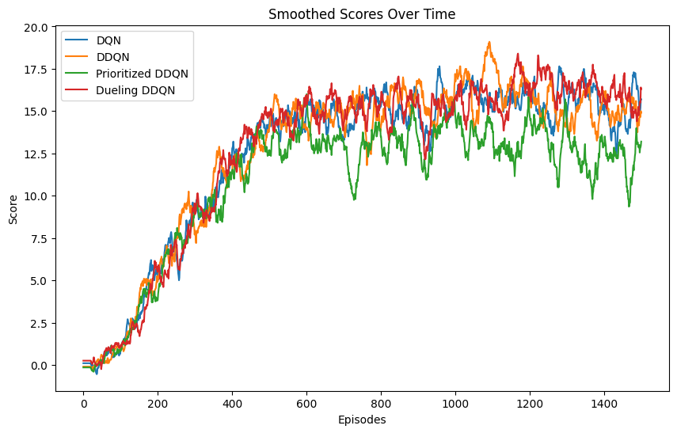

# Deep Q-Network for Unity Banana Collector Environment

This repository implements a Deep Q-Network (DQN) to solve the Unity Banana Collector environment. The agent is trained to navigate and collect yellow bananas while avoiding blue bananas to maximize the score.


## Table of Contents

- [Deep Q-Network for Unity Banana Collector Environment](#deep-q-network-for-unity-banana-collector-environment)
  - [Table of Contents](#table-of-contents)
  - [Environment Details](#environment-details)
  - [Getting Started](#getting-started)
    - [Prerequisites](#prerequisites)
    - [Installation](#installation)
    - [Instructions](#instructions)
  - [Model Architecture](#model-architecture)
    - [Neural Network Layers](#neural-network-layers)
      - [Feature-Based Environment Architecture](#feature-based-environment-architecture)
      - [Visual Environment Architecture](#visual-environment-architecture)
  - [Performance](#performance)

---

## Environment Details

The Unity Banana Collector environment is a simulated space where an agent navigates to collect yellow bananas (+1 reward) and avoid purple bananas (-1 reward). The environment offers two versions:

1. **Feature-Based Environment**: Provides a 37-dimensional state vector that includes the agent's velocity, ray-based perceptions of objects, and positional data.
2. **Visual Environment**: Provides 84x84 RGB images of the game, offering a more challenging setup where the agent must learn from raw pixel data.

**Note**: On Mac OSX, the `VisualBanana.app` environment frequently crashes in Unity after approximately 200 episodes. Due to this instability, we were unable to complete training in the VisualBanana environment to fully test the algorithms. This issue may also affect other platforms, as the code for this environment is based on an older version of Unity ML-Agents.

Key details:

- **State Space**:
  - **Feature-Based**: 37 dimensions
  - **Visual-Based**: 84x84 RGB image
- **Action Space**: 4 discrete actions (move forward, move backward, turn left, turn right)
- **Goal**: Achieve an average score of +13 over 100 consecutive episodes to consider the environment solved.

## Getting Started

### Prerequisites

To run this project, you need the following installed:

- Python 3.6 or higher
- Other dependencies (install via `install.sh` as shown below)

### Installation

1. Clone this repository:
   ```bash
   git clone https://github.com/legalaspro/deep-q-network-banana-collector.git
   cd deep-q-network-banana-collector
   ```
2. Install dependencies:

   ```bash
   source ./install.sh
   ```

   This command installs all required Python dependencies.

3. Download the Unity Environments. Select the environment that matches your operating system:

   - Banana environment:

     - Linux: [click here](https://s3-us-west-1.amazonaws.com/udacity-drlnd/P1/Banana/Banana_Linux.zip)
     - Mac OSX: [click here](https://s3-us-west-1.amazonaws.com/udacity-drlnd/P1/Banana/Banana.app.zip)
     - Windows (32-bit): [click here](https://s3-us-west-1.amazonaws.com/udacity-drlnd/P1/Banana/Banana_Windows_x86.zip)
     - Windows (64-bit): [click here](https://s3-us-west-1.amazonaws.com/udacity-drlnd/P1/Banana/Banana_Windows_x86_64.zip)

   - Visual Banana environment:
     - Linux: [click here](https://s3-us-west-1.amazonaws.com/udacity-drlnd/P1/Banana/VisualBanana_Linux.zip)
     - Mac OSX: [click here](https://s3-us-west-1.amazonaws.com/udacity-drlnd/P1/Banana/VisualBanana.app.zip)
     - Windows (32-bit): [click here](https://s3-us-west-1.amazonaws.com/udacity-drlnd/P1/Banana/VisualBanana_Windows_x86.zip)
     - Windows (64-bit): [click here](https://s3-us-west-1.amazonaws.com/udacity-drlnd/P1/Banana/VisualBanana_Windows_x86_64.zip)

   Place the downloaded file in the features folder for the Banana environment or in the visual folder for the Visual Banana environment within the repository.

### Instructions

Open `Navigation.ipynb` for the **features environment** or `Navigation_Pixels.ipynb` for the **visual environment** to train the agent using DQN. Each notebook guides you through the following steps:

1. Initialize the Unity environment.
2. Define the agent using one of several DQN architectures.
3. Train the agent over a specified number of episodes.
4. Monitor and plot the score over episodes to assess performance.
5. To test a pre-trained agent, load the model weights and run an evaluation episode.

The code for the agent is defined in `dqn_agent.py` within each folder (`features` and `visual`). The `dqn_agent.py` file provides implementations for several variants of DQN, including:

- **Standard DQN**
- **Double DQN**
- **Dueling DQN**
- **Prioritized DQN**

These variants offer flexibility in choosing the approach that best suits the environment and learning goals.

## Model Architecture

The DQN agent architecture allows for flexible selection between several DQN variants, enabling the user to choose the most suitable for their specific environment (feature-based or visual). The agent supports:

1. **Standard DQN**: The original Deep Q-Network, which approximates the Q-function with neural networks to estimate the value of each action in a given state.

   - **Paper**: [Human-level control through deep reinforcement learning](https://web.stanford.edu/class/psych209/Readings/MnihEtAlHassibis15NatureControlDeepRL.pdf)

2. **Double DQN (DDQN)**: Reduces the overestimation bias in action-value estimates by decoupling the selection of the best action from the evaluation of that action.

   - **Paper**: [Deep Reinforcement Learning with Double Q-learning](https://arxiv.org/pdf/1509.06461)

3. **Dueling DQN**: Splits the Q-network into two streams—one for state-value estimation and one for advantage estimation. This design enables the agent to better distinguish valuable actions, improving learning efficiency.

   - **Paper**: [Dueling Network Architectures for Deep Reinforcement Learning](https://arxiv.org/pdf/1511.06581)

4. **Prioritized Experience Replay**: Prioritizes important experiences in replay memory, enabling the agent to learn from critical states more effectively by sampling based on experience importance.
   - **Paper**: [Prioritized Experience Replay](https://arxiv.org/pdf/1511.05952)

Each of these variants can be selected and used with both the **feature-based environment** (37-dimensional state space) and the **visual environment** (84x84 RGB image state space), providing flexibility for different training and evaluation scenarios.

### Neural Network Layers

The Q-network architecture is adapted based on the environment type (feature-based or visual) to best handle each input format. The design is modular, allowing for selection between different DQN architectures to train the agent in either environment.

#### Feature-Based Environment Architecture

For the **feature-based environment** (37-dimensional state space), the network is a fully connected architecture with:

- **Input layer**: Takes in the 37-dimensional state vector.
- **Hidden layers**: Three fully connected layers with 128, 64, and 32 neurons, allowing the network to learn complex patterns in the state data.
- **Output layer**: A final layer with 4 neurons corresponding to the action space (move forward, move backward, turn left, turn right).

This structure provides flexibility for learning from the compact feature representation provided by the environment.

#### Visual Environment Architecture

For the **visual environment** (84x84 RGB images), the network is a convolutional neural network (CNN) designed to handle spatial information:

- **Convolutional Layers**:
  - The network begins with three convolutional layers to extract spatial features from the 84x84 RGB image:
    - **Conv1**: Extracts features with 32 feature maps and an 8x8 kernel with stride of 4.
    - **Conv2**: Refines features with 64 feature maps and a 4x4 kernel with stride of 2.
    - **Conv3**: Further processes features with 64 feature maps and a 3x3 kernel with stride of 1.
- **Fully Connected Layer**: A dense layer with 512 neurons processes the flattened output of the convolutional layers.
- **Output Layer**: A final layer with 4 neurons, representing the possible actions.

This architecture allows the network to effectively learn from visual input, extracting complex spatial relationships and patterns from image data.

## Performance

The agent achieves varying levels of performance depending on the DQN variant used for training in the **feature-based environment**. Below is a comparison of performance for each variant after training:


