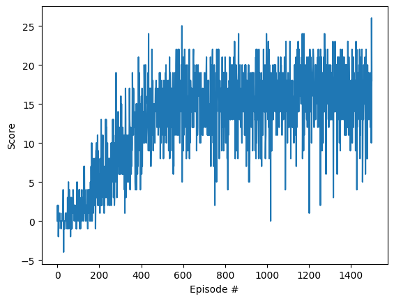
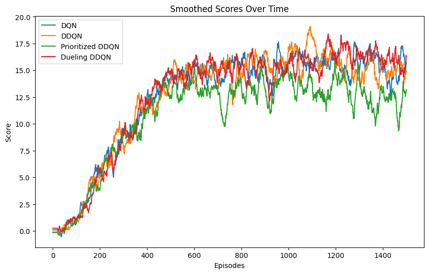

# Report for Deep Q-Network Agent in Unity Banana Collector Environment

This report describes the structure and function of each key file in the project, the operation and extensions of the DQN algorithm used, selected hyperparameters, neural network architectures, and a summary of training results. The agent’s goal is to maximize its reward by collecting yellow bananas and avoiding purple ones.

---

## Files in Each Environment

Each environment folder contains the following key files:

- `dqn_agent.py`: Defines the main agent class, responsible for managing actions, learning processes, and handling reinforcement learning (RL) hyperparameters.
- `Navigation.ipynb` (for features environment) or `Navigation_pixels.ipynb` (for visual environment): Jupyter notebooks to initiate training, visualize performance, and test the agent.
- `replay_buffer.py` and `prioritized_replay_buffer.py`: Manage the experience replay buffers. `prioritized_replay_buffer.py` specifically handles prioritized experience replay to improve sample efficiency.
- **Feature Environment**:
  - `standard_model.py` and `dueling_model.py`: Neural network architectures for the feature-based environment, with `dueling_model.py` implementing the Dueling DQN variant.
  - `checkpoints_*`: saved model weights from training, used for evaluation or resuming training.
- **Visual Environment**:
  - `cnn_model.py` and `cnn_dueling_model.py`: Neural network architectures for the visual environment, with `cnn_dueling_model.py` implementing the Dueling DQN variant.
  - `image_processor.py`: Prepares image frames for input into the CNN models by resizing, converting to grayscale, and stacking frames.

These files support running and evaluating the agent in both the feature and visual-based environments, with options for prioritized experience replay, standard and dueling architectures, and image processing as required by the visual environment.

---

## Deep Q-Network (DQN) Overview

DQN is an RL algorithm that combines Q-learning with neural networks, enabling agents to learn directly from high-dimensional inputs like images. Initially developed to play Atari games, it approximates a Q-value function that maps state-action pairs to expected cumulative rewards. Through repeated interactions with the environment, the agent learns a policy that selects actions to maximize rewards.

In each step:

- The agent observes a state, takes an action, receives a reward, and moves to the next state.
- Q-values are updated to reflect the learned value of each action in each state, aiming to approximate the optimal Q-value function.
- The DQN loss function is used to adjust the neural network weights, minimizing the difference between predicted and target Q-values.

Training employs an epsilon-greedy policy to balance exploration and exploitation, starting with random actions and gradually shifting towards the learned policy as training progresses.

---

## Hyperparameters

The following hyperparameters were selected to support effective and stable learning in the Banana environment:

```plaintext
BUFFER_SIZE = 1e5       # Capacity of replay buffer
BATCH_SIZE = 64         # Size of mini-batches for training
GAMMA = 1.0             # Discount factor for future rewards
TAU = 1e-3              # Factor for soft updates of target network
LR = 5e-4               # Learning rate for optimizer
UPDATE_EVERY = 4        # Frequency of network updates
ALPHA = 0.5             # Priority sampling factor (0 = uniform, 1 = prioritizes important samples)
BETA = 0.4              # Initial beta for importance sampling, annealed over time
EPSILON_PER = 0.2       # Small constant for stability in prioritized experience replay
```

## Neural Network Architectures

Two distinct network architectures were used based on the environment type:

- **Feature-Based Environment (Banana)**: This environment uses a fully connected neural network with three layers and ReLU activations. The input layer size is 37 (corresponding to the state vector), and the final layer outputs Q-values for each of the 4 actions.

- **Visual Environment (Visual Banana)**: A convolutional neural network (CNN) based on the architecture used by Mnih et al. (2015) is employed here. This architecture includes three convolutional layers followed by fully connected layers, designed to capture spatial patterns in the 84x84 RGB image input and make effective decisions based on visual cues.

For both architectures, the **Adam optimizer** was chosen for gradient descent to adjust network weights during training.

## DQN Extensions

This implementation includes several DQN extensions that improve learning efficiency and stability:

- **Double DQN**: Reduces overestimation bias by decoupling action selection from action evaluation.

  - **Paper**: [Double Q-learning](https://arxiv.org/pdf/1509.06461)

- **Dueling DQN**: Divides the network into two streams—one for state-value estimation and one for advantage estimation—enabling better differentiation between valuable and non-valuable actions.

  - **Paper**: [Dueling Architecture](https://arxiv.org/pdf/1511.06581)

- **Prioritized Experience Replay**: Prioritizes important experiences in the replay buffer to replay critical transitions more frequently, enhancing sample efficiency.
  - **Paper**: [Prioritized Experience Replay](https://arxiv.org/pdf/1511.05952)

These extensions are activated by default in the agent code, but they can be turned off by modifying the corresponding flags in `dqn_agent.py`.

---

## Training Results

The agent’s performance was measured by tracking the average reward over 100 episodes, and training continued until the agent consistently achieved a score above the target threshold of +13.

Below are plots showing the agent's training performance:

- **Dueling DDQN Performance**: This plot shows the training performance for the **Dueling DDQN** architecture in the feature-based environment.

  

- **Smoothed Training Scores**: This plot displays the smoothed average scores for four different network architectures (DQN, Double DQN, Prioritized DDQN, and Dueling DDQN) in the feature-based environment, providing a comparison of each variant's performance.

  

## Future Work

Several improvements and further experiments could enhance the project:

- **Fix Visual Banana Environment Stability**: Investigate and resolve the crashing issue in the Visual Banana environment to enable full training and testing. This would allow a complete comparison of DQN variants in both feature-based and visual setups.

- **Optimize Image Preprocessing**: Experiment with optimized preprocessing techniques (e.g., frame skipping, selective grayscale conversion) in the visual environment to improve training efficiency without sacrificing performance.

- **Experiment with Advanced DQN Extensions**: Test more recent DQN extensions, such as Rainbow DQN, which combines multiple techniques like distributional RL and noisy networks, to evaluate if further performance gains are achievable.

- **Hyperparameter Optimization**: Apply automated hyperparameter tuning (e.g., using Bayesian optimization or genetic algorithms) to find the optimal settings for the learning rate, batch size, and other hyperparameters to further improve learning performance and stability.

These extensions and improvements could provide greater insights into the robustness and versatility of DQN-based agents in complex environments.
